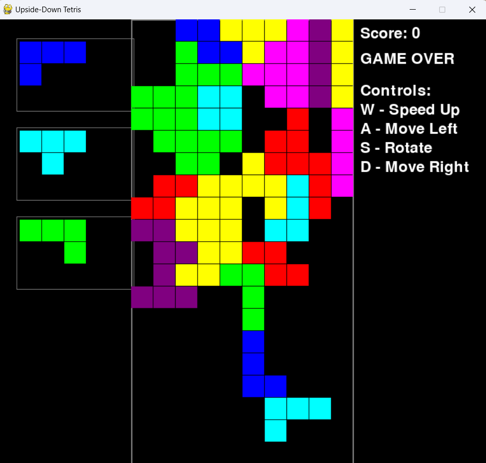

# SIRTET
# 🎮 Upside-Down Tetris

A creative twist on the classic Tetris game built with Python and Pygame, where blocks rise from the bottom instead of falling from the top! Experience Tetris in a whole new way with this unique reverse-gravity mechanic.

 <!-- You'll need to add this -->

## ✨ Key Features

- 🔄 Reverse gravity mechanics - blocks rise instead of fall
- 👀 Preview panel showing next 3 pieces
- 🎯 Intuitive controls with WASD keys
- 🎨 Colorful block designs
- 📊 Real-time score tracking
- 🖼️ Clean and modern UI
- 🎪 Smooth gameplay experience

## 🎯 How to Play

### Controls
```
W - Speed up piece movement
A - Move piece left
D - Move piece right
S - Rotate piece
```

### Game Rules
1. Pieces rise from the bottom of the screen
2. Arrange pieces to create complete horizontal lines
3. Completed lines disappear and award points
4. Game ends when pieces stack to the top
5. Plan ahead using the next-piece preview panel

## 🚀 Quick Start

### Prerequisites
- Python 3.8 or higher
- Pygame 2.5.2 or higher

### Installation

1. Clone the repository
```bash
git clone https://github.com/yourusername/upside-down-tetris.git
cd upside-down-tetris
```

2. Set up a virtual environment (recommended)
```bash
# Create virtual environment
python -m venv venv

# Activate virtual environment
# For Windows:
venv\Scripts\activate
# For macOS/Linux:
source venv/bin/activate
```

3. Install dependencies
```bash
pip install -r requirements.txt
```

4. Run the game
```bash
python tetris.py
```

## 🛠️ Technical Details

### Built With
- Python 3.x
- Pygame 2.5.2

### Project Structure
```
upside-down-tetris/
├── src/
│   └── tetris.py      # Main game file
├── screenshots/       # Game screenshots
├── requirements.txt   # Project dependencies
├── .gitignore        # Git ignore file
└── README.md         # Project documentation
```

## 🔮 Future Enhancements

- [ ] Local high score system
- [ ] Sound effects and background music
- [ ] Multiple difficulty levels
- [ ] Achievement system
- [ ] Pause functionality
- [ ] Settings menu
- [ ] Mobile touch support

## 🤝 Contributing

We welcome contributions! Here's how:

1. Fork the repository
2. Create your feature branch (`git checkout -b feature/AmazingFeature`)
3. Commit your changes (`git commit -m 'Add some AmazingFeature'`)
4. Push to the branch (`git push origin feature/AmazingFeature`)
5. Open a Pull Request

### Contribution Guidelines
- Write clear, descriptive commit messages
- Comment your code where necessary
- Follow Python PEP 8 style guide
- Test your changes thoroughly

## 📝 Game Features Explained

### Piece Movement
- Pieces automatically rise from bottom to top
- Player can move pieces left/right
- Rotation system follows standard Tetris rules
- Speed up feature for faster gameplay

### Scoring System
- 100 points per line cleared
- Bonus points for multiple lines
- Real-time score display

### Preview System
- Shows next 3 pieces
- Helps in strategic planning
- Located on the left side of the game field

## ⚙️ Development Setup

### Required Software
- Python 3.8+
- Git
- Code editor (VS Code recommended)

<p align="center">
  Made with ❤️ by Mahesh
</p>

